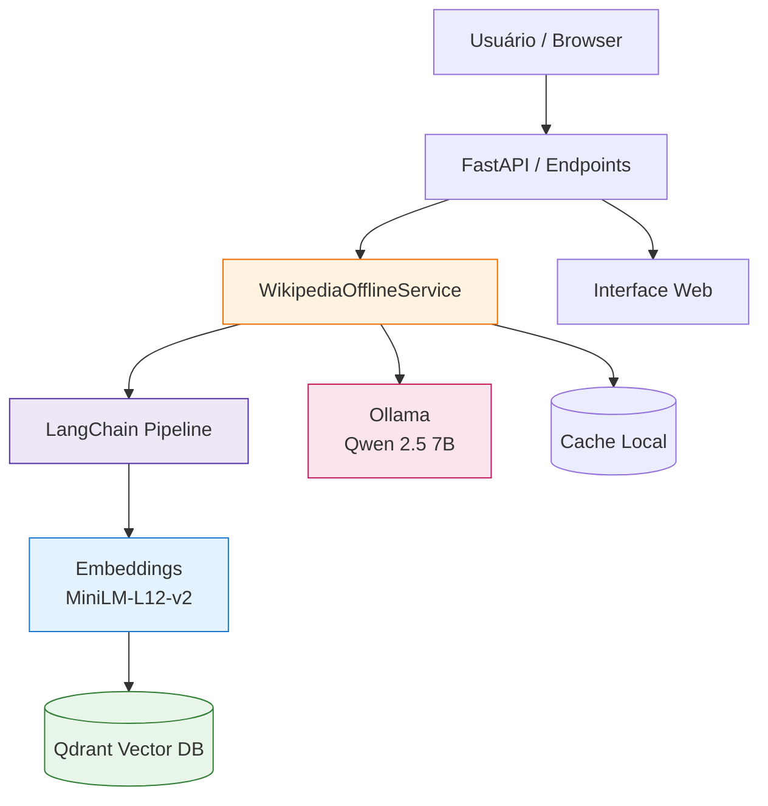

# 🧠 Custom Knowledge Base

**Sistema RAG (Retrieval-Augmented Generation) genérico e extensível** para criar sua própria base de conhecimento com busca semântica e geração de respostas por IA. Atualmente implementado com Wikipedia, mas preparado para qualquer fonte de dados.

[](https://fastapi.tiangolo.com/) [](https://www.python.org/) [](https://www.docker.com/) [](https://qdrant.tech/) [](https://langchain.com/) [](https://ollama.ai/)

---

## 🎯 Visão Geral

Uma plataforma completa para criar e consultar bases de conhecimento customizadas usando tecnologias de ponta em IA. O sistema combina **busca vetorial semântica** com **modelos de linguagem (LLMs)** para fornecer respostas precisas baseadas em seus próprios dados.

### ✨ Por que usar?

- **🔒 100% Privado**: Tudo roda localmente - nenhum dado sai do seu servidor
- **🌐 Offline-First**: Funciona sem internet após configuração inicial  
- **🎨 Genérico**: Adaptável para qualquer domínio (documentação, manuais, artigos, etc.)
- **⚡ Rápido**: Busca vetorial otimizada + LLM local eficiente
- **🔧 Extensível**: Arquitetura modular fácil de customizar
- **📊 Completo**: API REST + Interface Web + Scripts utilitários

###  Funcionalidades Principais

- 🔍 **Busca Semântica Multilíngue**: Embeddings `paraphrase-multilingual-MiniLM-L12-v2` (384d)
- 🤖 **Respostas RAG Contextualizadas**: Qwen 2.5 7B via Ollama (ou qualquer modelo compatível)
- 📚 **Adição Dinâmica de Conteúdo**: API para adicionar artigos da Wikipedia ou outras fontes
- 📄 **Chunking Inteligente**: Divisão otimizada de documentos com LangChain
- 💾 **Armazenamento Vetorial**: Qdrant para busca vetorial de alta performance
- 🌐 **Interface Web Completa**: UI para perguntas, busca e gerenciamento
- 🎨 **Métricas de Performance**: Timing de busca e geração em tempo real
- ✅ **48 Testes Unitários**: 100% de cobertura nos componentes críticos
- 🐳 **Docker Completo**: Setup com um comando, zero configuração manual
- 🛠️ **Scripts Multiplataforma**: `utils.sh` (Linux/Mac/WSL) e `utils.ps1` (Windows)

---

##  Arquitetura



### Fluxo Resumido

1. Pergunta  embeddings  busca vetorial  contexto  prompt  LLM  resposta
2. Adição de artigo  fetch  limpeza  chunking  embeddings  armazenamento

---

## 🚀 Início Rápido

### Pré-requisitos
- Docker & Docker Compose
- 8GB+ RAM (recomendado)
- ~10GB espaço em disco

### Instalação (3 comandos)

```bash
# 1. Clone o repositório
git clone https://github.com/ekotuja-AI/custom-knowledge-base.git
cd custom-knowledge-base

# 2. Inicie os containers
docker-compose up -d

# 3. Aguarde ~2 minutos e acesse
# http://localhost:9000
```

### Uso Imediato

**Interface Web**: http://localhost:9000
- Faça perguntas
- Busque artigos
- Adicione novo conteúdo

**Scripts Utilitários**:
```bash
# Linux/Mac/Git Bash/WSL
bash utils.sh status
bash utils.sh test "Qual a capital da França?"
bash utils.sh add-article "Python (linguagem)"

# Windows PowerShell
.\utils.ps1 -Command status
.\utils.ps1 -Command test -Query "Qual a capital da França?"
.\utils.ps1 -Command add-article -Title "Python (linguagem)"
```

**Teste via API**:
```bash
curl -X POST http://localhost:9000/perguntar \
  -H 'Content-Type: application/json' \
  -d '{"pergunta": "O que é inteligência artificial?"}'
```

Resposta:
```json
{
  "pergunta": "O que é inteligência artificial?",
  "resposta": "Inteligência artificial é um campo da ciência da computação...",
  "contexto_usado": 5,
  "artigos_fonte": ["Inteligência artificial", "Aprendizado de máquina"],
  "search_time": 0.234,
  "generation_time": 2.156
}
```

---

## 📚 Comandos Úteis

### Scripts Utilitários (`utils.sh` / `utils.ps1`)

| Comando | Descrição | Exemplo |
|---------|-----------|---------|
| `restart` | Reinicia containers | `bash utils.sh restart` |
| `logs` | Logs da aplicação | `bash utils.sh logs` |
| `status` | Status do sistema | `bash utils.sh status` |
| `test` | Testa query com timing | `bash utils.sh test "pergunta"` |
| `add-article` | Adiciona artigo | `bash utils.sh add-article "Título"` |
| `search` | Busca semântica | `bash utils.sh search "termo"` |
| `shell` | Shell no container | `bash utils.sh shell` |
| `qdrant-info` | Info do Qdrant | `bash utils.sh qdrant-info` |
| `python` | Executa script Python | `bash utils.sh python scripts/listar_artigos.py` |

Veja documentação completa em [`README_UTILS.md`](README_UTILS.md).

---

### 📦 Gerenciamento de Modelos de Embedding

- **Listar modelos baixados e ver o modelo ativo:**
  ```bash
  python scripts/ver_modelos_embedding.py
  ```
  - Mostra todos os modelos de embedding no cache do HuggingFace e o modelo atualmente ativo no serviço LangChain.

- **Trocar modelo de embedding dinamicamente:**
  - Use o endpoint `/trocar_modelo` via API ou o script de teste para alterar o modelo sem reiniciar o container.

---

## 🔌 API REST Completa

| Método | Rota | Função | Exemplo |
|--------|------|--------|---------|
| GET | `/` | Interface web principal | - |
| GET | `/artigos.html` | Navegador de artigos | - |
| GET | `/artigos` | Lista todos os artigos (JSON) | `curl http://localhost:9000/artigos` |
| POST | `/buscar` | Busca semântica | `{"query":"IA","limite":5}` |
| POST | `/perguntar` | Pergunta usando RAG | `{"pergunta":"O que é...?"}` |
| POST | `/adicionar-artigo` | Adiciona artigo Wikipedia | `{"titulo":"Python","reprocessar":false}` |
| GET | `/estatisticas` | Métricas (chunks, artigos) | `curl http://localhost:9000/estatisticas` |
| GET | `/status` | Saúde do sistema | `curl http://localhost:9000/status` |

### 🖥️ Interface Web

🖥️ **Página Principal** (`http://localhost:9000/`)
- Fazer perguntas com IA
- Buscar artigos semanticamente
- Adicionar novos artigos (manual ou aleatório)

📚 **Navegador de Artigos** (`http://localhost:9000/artigos.html`)
- Ver todos os artigos na base
- Buscar por palavra-chave (tempo real)
- Ordenar por nome, chunks ou recência
- Acesso direto à Wikipedia

###  Exemplos API

**Busca semântica**:
```bash
curl -X POST http://localhost:9000/buscar \
 -H 'Content-Type: application/json' \
 -d '{"query":"inteligência artificial","limite":5}'
```

**Adicionar artigo**:
```bash
curl -X POST http://localhost:9000/adicionar-artigo \
 -H 'Content-Type: application/json' \
 -d '{"titulo":"Machine Learning","reprocessar":false}'
```

**Listar artigos**:
```bash
curl http://localhost:9000/artigos | jq
```

**Estatísticas**:
```bash
curl http://localhost:9000/estatisticas
```

---

## 🧪 Testes

```bash
# Executar todos os testes
python -m pytest tests/ -v

# Com cobertura
python -m pytest tests/ --cov=api --cov=services --cov-report=term-missing

# Via Docker
docker exec offline_wikipedia_app pytest /app/tests/ -v
```

**Resultado esperado**:
```
================================ test session starts ================================
48 passed in 3.52s
================================ 48 passed in 3.52s =================================
```

Todos os testes passando! ✅ Veja detalhes em [`tests/RESULTADOS_TESTES.md`](tests/RESULTADOS_TESTES.md)

---

## ⚙️ Configuração

### Variáveis de Ambiente (`.env`)

```env
# Qdrant (Vector Database)
QDRANT_HOST=qdrant
QDRANT_PORT=6333
COLLECTION_NAME=wikipedia_langchain

# Ollama (LLM)
OLLAMA_HOST=ollama
OLLAMA_PORT=11434
LLM_MODEL=qwen2.5:7b

# Embeddings
EMBEDDING_MODEL=paraphrase-multilingual-MiniLM-L12-v2
EMBEDDING_SIZE=384

# API
API_PORT=9000

# Chunking
CHUNK_SIZE=500
CHUNK_OVERLAP=50
```

### Ajustes Finos (`services/langchainWikipediaService.py`)

```python
# Threshold de similaridade (adapta ao tamanho da base)
MIN_SIMILARITY_SCORE:
  < 10 docs:  0.08   # Bases muito pequenas
  10-50 docs: 0.15   # Bases médias  
  > 50 docs:  0.25   # Bases grandes

# RAG
max_chunks = 5           # Contexto usado no prompt
temperature = 0.7        # Criatividade (0.0-1.0)
num_predict = 800        # Tokens máximos na resposta
top_k = 40              # Top-K sampling
top_p = 0.9             # Nucleus sampling
```

### Trocar Modelo LLM

```bash
# 1. Baixar modelo no Ollama
docker exec ollama_server ollama pull llama3:8b

# 2. Atualizar .env
LLM_MODEL=llama3:8b

# 3. Reiniciar
docker-compose restart offline_wikipedia_app
```

---

## 📁 Estrutura do Projeto

```
custom-knowledge-base/
├── api/                          # 🌐 API REST (FastAPI + Pydantic)
│   ├── config.py                # Configurações centralizadas
│   ├── models.py                # Modelos Pydantic (request/response)
│   └── wikipediaFuncionalAPI.py # Endpoints e rotas
├── services/                     # 🔧 Lógica de negócio
│   ├── langchainWikipediaService.py  # Service principal (RAG + LangChain)
│   ├── offlineWikipediaService.py    # Service legado
│   └── utils/                       # Pacote de utilitários
│       └── wikipedia_utils.py        # Utilitários Wikipedia
├── static/                       # 🎨 Frontend
│   ├── index.html               # Página principal
│   └── artigos.html             # Navegador de artigos
├── scripts/                      # 📜 Scripts Python utilitários
│   ├── adicionar_artigos.py     # Adiciona artigos em lote
│   ├── listar_artigos.py        # Lista artigos no Qdrant
│   └── processar_via_api.py     # Processa via API
├── tests/                        # ✅ Testes unitários (48 testes)
│   ├── test_config.py           # Testa configurações
│   ├── test_models.py           # Testa modelos Pydantic
│   ├── test_services.py         # Testa services
│   └── test_integration.py      # Testes de integração
├── data/                         # � Dados e cache
│   ├── artigos.json             # Artigos processados
│   └── artigos_wikipedia.txt    # Lista de artigos
├── docs/                         # 📚 Documentação
│   ├── CHANGELOG.md             # Histórico de mudanças
│   ├── TIMING_IMPLEMENTATION.md # Métricas de performance
│   └── DOCKER_IMPLEMENTATION_GUIDE.md
├── docker/                       # 🐳 Configs Docker alternativas
├── models/                       # � Modelos de embeddings (cache)
├── utils.sh                      # 🛠️ Utilitários (Linux/Mac/WSL)
├── utils.ps1                     # 🛠️ Utilitários (Windows)
├── README_UTILS.md               # 📖 Docs dos utilitários
├── Dockerfile                    # 🐳 Build da aplicação
├── docker-compose.yml            # 🎼 Orquestração
├── requirements_minimal.txt      # 📦 Dependências Python
└── README.md                     # 📖 Este arquivo
```

---

## 🐳 Docker

### Comandos Básicos

```bash
# Iniciar todos os serviços
docker-compose up -d

# Ver logs em tempo real
docker-compose logs -f offline_wikipedia_app

# Parar todos os serviços
docker-compose down

# Reiniciar um serviço específico
docker-compose restart offline_wikipedia_app

# Rebuild após mudanças no código
docker-compose down
docker-compose build
docker-compose up -d
```

### Shell Interativo

```bash
# App principal
docker exec -it offline_wikipedia_app bash

# Ollama
docker exec -it ollama_server bash

# Qdrant (Alpine Linux)
docker exec -it qdrant_offline sh
```

### Gerenciar Modelos Ollama

```bash
# Listar modelos instalados
docker exec ollama_server ollama list

# Baixar novo modelo
docker exec ollama_server ollama pull llama3:8b

# Remover modelo
docker exec ollama_server ollama rm qwen2.5:7b

# Testar modelo
docker exec ollama_server ollama run qwen2.5:7b "Olá, mundo!"
```

---

## 🔧 Troubleshooting

### Problemas Comuns

| Problema | Causa Provável | Solução |
|----------|----------------|---------|
| Busca retorna vazio | Threshold muito alto ou sem dados | Reduza `MIN_SIMILARITY_SCORE` para 0.15 e adicione artigos |
| Resposta muito genérica | Pouco contexto recuperado | Aumente `max_chunks` para 8-10 |
| Ollama não responde | Modelo não baixado | `docker exec ollama_server ollama pull qwen2.5:7b` |
| Container não inicia | Porta em uso | Mude `API_PORT` no `.env` ou libere a porta 9000 |
| Erro de memória | RAM insuficiente | Use modelo menor (qwen2.5:3b) ou aumente RAM Docker |
| Testes falham | Dependências desatualizadas | `pip install -r requirements_minimal.txt --upgrade` |
| Qdrant vazio | Nenhum artigo adicionado | Use `bash utils.sh add-article "Título"` |

### Diagnóstico Rápido

```bash
# Status de todos os serviços
bash utils.sh status

# Verificar saúde da API
curl http://localhost:9000/status

# Estatísticas do Qdrant
curl http://localhost:9000/estatisticas

# Logs detalhados
docker-compose logs --tail=100 offline_wikipedia_app

# Verificar se Ollama está respondendo
docker exec ollama_server ollama list
```

### Performance

**Se as respostas estão lentas**:
1. Use modelo menor: `llama3:3b` ou `qwen2.5:3b`
2. Reduza `num_predict` para 400-500 tokens
3. Reduza `max_chunks` para 3-4
4. Verifique uso de CPU/RAM: `docker stats`

**Se a busca está imprecisa**:
1. Ajuste `MIN_SIMILARITY_SCORE` (menor = mais resultados)
2. Adicione mais artigos relevantes ao domínio
3. Use queries mais específicas
4. Considere usar modelo de embedding maior

---

## 🆕 Novidades Recentes

- Telemetria incremental via WebSocket: status detalhado da busca e geração exibido em tempo real na interface web.
- Timer incremental entre mensagens de telemetria: cada etapa do backend é enviada com espaçamento perceptível para melhor UX.
- Formatação de data/hora nas mensagens de telemetria: datas exibidas em formato legível.
- Filtro de termos aprimorado: perguntas abertas como "o que é Jakarta?" agora extraem corretamente o termo principal, garantindo resultados relevantes.
- Troubleshooting atualizado: se a mensagem de status só aparece após a resposta, verifique se o frontend está ouvindo o WebSocket e exibindo incrementalmente.
- Suporte a múltiplas coleções e troca dinâmica de modelo de embedding via API.
- Script utilitário para listar modelos e mostrar o modelo ativo.
- Limpeza e organização dos arquivos de documentação.

---

## 🗺️ Roadmap

### ✅ Implementado (v1.2)
- [x] RAG básico com LangChain
- [x] Busca semântica com Qdrant
- [x] Interface web completa
- [x] API REST documentada
- [x] Testes unitários (48 testes)
- [x] Docker completo (3 containers)
- [x] Scripts utilitários multiplataforma
- [x] Métricas de timing em tempo real
- [x] Threshold adaptativo por tamanho da base
- [x] Text index para busca full-text
- [x] Suporte a múltiplas coleções e troca dinâmica de modelo de embedding

### 🚧 Em Desenvolvimento (v1.3)
- [ ] Cache Redis para respostas frequentes
- [ ] Reranking de resultados
- [ ] Histórico de perguntas
- [ ] Suporte a múltiplas coleções
- [ ] Dashboard de analytics

### 🔮 Futuro (v2.0+)
- [ ] Suporte a PDFs e documentos
- [ ] Streaming de respostas (SSE)
- [ ] Multi-modal (imagens + texto)
- [ ] Fine-tuning de embeddings
- [ ] Autenticação e multi-usuário
- [ ] Integração com fontes externas (Confluence, Notion, etc.)
- [ ] Geração de resumos automáticos
- [ ] Exportação de conhecimento

---
