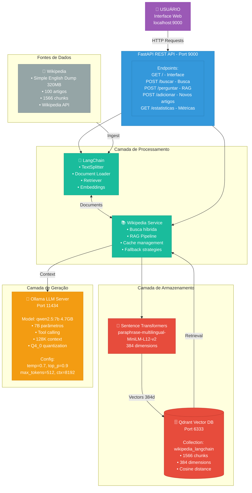
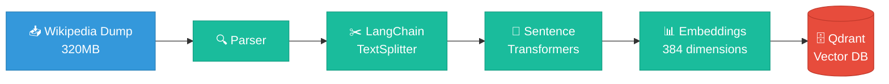
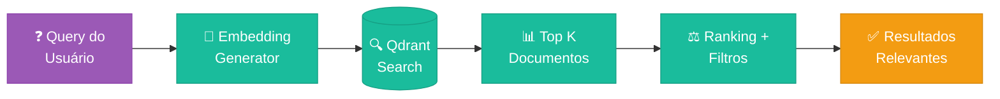
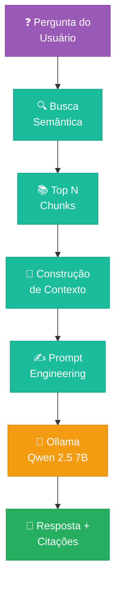

# 📖 Sistema RAG Offline - Wikipedia + LangChain + Ollama

**Sistema completo de Retrieval-Augmented Generation (RAG) offline utilizando Wikipedia, LangChain e LLM local.**

[](https://fastapi.tiangolo.com/)
[](https://www.python.org/downloads/)
[](https://www.docker.com/)
[](https://qdrant.tech/)
[](https://langchain.com/)

## 🎯 Visão Geral

Um sistema RAG (Retrieval-Augmented Generation) completo e **100% offline** que combina:
- 🌐 **Wikipedia** como base de conhecimento
- 🔍 **Busca vetorial semântica** com Qdrant
- 🤖 **LLM local** (Qwen 2.5 7B) via Ollama
- ⚡ **LangChain** para processamento de documentos
- 🎨 **Interface web moderna** para consultas

### ✨ Funcionalidades Principais

- ✅ **Busca Semântica**: Encontra informações por similaridade, não apenas palavras-chave
- ✅ **Perguntas Inteligentes**: Respostas contextualizadas usando LLM + conhecimento da Wikipedia
- ✅ **100% Offline**: Funciona completamente sem internet após setup inicial
- ✅ **Tool Calling**: Suporte nativo a function calling com Qwen 2.5
- ✅ **Processamento em Lote**: Ingestão eficiente de dumps da Wikipedia
- ✅ **Interface Web**: UI moderna com gradiente purple

## 🏗️ Arquitetura

### Diagrama de Componentes

<div align="center">
  
</div>

<details>
<summary>📊 Ver diagrama Mermaid interativo (clique para expandir)</summary>



</details>


### Fluxo de Dados

#### 1️⃣ **Ingestão de Documentos**



#### 2️⃣ **Busca Semântica**



#### 3️⃣ **RAG (Retrieval-Augmented Generation)**



### Stack Tecnológico

| Componente | Tecnologia | Versão | Função |
|------------|------------|--------|--------|
| **API Framework** | FastAPI | 0.104+ | REST API assíncrona |
| **Vector Database** | Qdrant | 1.11.3 | Armazenamento vetorial |
| **LLM Server** | Ollama | 0.12.9 | Servidor de modelos |
| **LLM Model** | Qwen 2.5 | 7B | Geração de respostas |
| **Embeddings** | SentenceTransformers | 2.3.0 | Vetorização multilíngue |
| **Document Processing** | LangChain | 0.1.0+ | Pipeline de documentos |
| **Containerization** | Docker Compose | - | Orquestração |
| **Language** | Python | 3.11+ | Runtime |

## 🚀 Quick Start

### Pré-requisitos

- **Docker & Docker Compose** instalados
- **8GB+ RAM** disponível
- **15GB+ espaço em disco** livre
- **Windows**, **Linux** ou **macOS**

### 1. Clone o Repositório

```bash
git clone https://github.com/ekotuja-AI/dicionario_vetorial.git
cd dicionario_vetorial
```

### 2. Inicie os Containers

```bash
# Inicia todos os serviços
docker-compose up -d

# Monitore os logs
docker-compose logs -f
```

### 3. Aguarde Inicialização

O sistema irá:
- ✅ Inicializar Qdrant (banco vetorial)
- ✅ Baixar Qwen 2.5 7B (~4.7GB) - **primeira vez apenas**
- ✅ Carregar modelo de embeddings
- ✅ Configurar FastAPI

**Tempo estimado**: 5-10 minutos na primeira execução

### 4. Acesse o Sistema

- 🌐 **Interface Web**: http://localhost:9000
- 📖 **Documentação API**: http://localhost:9000/docs
- 📊 **Status**: http://localhost:9000/status
- 📈 **Estatísticas**: http://localhost:9000/estatisticas

## 📊 Dados Atuais

### Base de Conhecimento

- **Fonte**: Simple Wikipedia (inglês simplificado)
- **Artigos**: 100 processados
- **Chunks**: 1566 vetorizados
- **Dimensões**: 384 (multilíngue)
- **Modelo Embedding**: paraphrase-multilingual-MiniLM-L12-v2

### Modelo LLM

- **Nome**: Qwen 2.5 (7B parâmetros)
- **Tamanho**: 4.7 GB
- **Quantização**: Q4_0
- **Contexto**: 128K tokens
- **Capabilities**: Tool calling, RAG, Multilíngue
- **Idiomas**: Português, Inglês, Espanhol, Chinês, +25 outros

## 🔧 Configuração

### Variáveis de Ambiente (.env)

```env
# Qdrant Vector Database
QDRANT_HOST=localhost
QDRANT_PORT=6333

# Ollama LLM Server
OLLAMA_HOST=localhost
OLLAMA_PORT=11434
LLM_MODEL=qwen2.5:7b
LLM_MAX_TOKENS=512
LLM_TEMPERATURE=0.7

# Embeddings Model
EMBEDDING_MODEL=paraphrase-multilingual-MiniLM-L12-v2

# Data Directories
DATA_DIR=./data
MODELS_DIR=./models
```

### Volumes Docker

| Volume | Descrição | Tamanho Aproximado |
|--------|-----------|-------------------|
| `qdrant_storage` | Dados do banco vetorial | ~500 MB |
| `ollama_models` | Modelos LLM | ~5 GB |
| `./data` | Dumps e cache | ~1 GB |

## 📚 Uso da API

### Busca Semântica

```bash
curl -X POST "http://localhost:9000/buscar" \
  -H "Content-Type: application/json" \
  -d '{"query": "inteligência artificial", "limite": 5}'
```

**PowerShell:**
```powershell
$body = '{"query": "inteligência artificial", "limite": 5}'
Invoke-RestMethod -Uri "http://localhost:9000/buscar" `
  -Method Post -Body $body -ContentType "application/json"
```

### Perguntas com RAG

```bash
curl -X POST "http://localhost:9000/perguntar" \
  -H "Content-Type: application/json" \
  -d '{"pergunta": "O que é Python?"}'
```

**PowerShell:**
```powershell
$body = '{"pergunta": "O que é Python?"}'
Invoke-RestMethod -Uri "http://localhost:9000/perguntar" `
  -Method Post -Body $body -ContentType "application/json"
```

### Adicionar Artigos

```bash
curl -X POST "http://localhost:9000/adicionar" \
  -H "Content-Type: application/json" \
  -d '{"titulo": "Machine Learning"}'
```

## 🎨 Interface Web

A interface web oferece:
- 🔍 **Busca interativa** com resultados em tempo real
- 💬 **Chat com IA** para perguntas complexas
- ➕ **Adicionar artigos** dinamicamente
- 📊 **Estatísticas** da base de conhecimento
- 🎨 **Design moderno** com gradiente purple

## 📖 Expandindo a Base

### Processar Dumps da Wikipedia

```bash
# 1. Baixar dump (executar dentro do container)
docker exec offline_wikipedia_app python scripts/download_wikipedia.py \
  --language simple \
  --max-articles 1000

# 2. O processamento é automático com LangChain
```

### Adicionar Artigos Específicos via API

```python
import requests

# Lista de artigos para adicionar
artigos = [
    "Artificial Intelligence",
    "Machine Learning",
    "Deep Learning",
    "Natural Language Processing"
]

for titulo in artigos:
    response = requests.post(
        "http://localhost:9000/adicionar",
        json={"titulo": titulo}
    )
    print(f"{titulo}: {response.json()}")
```

## 🐳 Gerenciamento Docker

### Comandos Úteis

```bash
# Iniciar serviços
docker-compose up -d

# Parar serviços
docker-compose stop

# Reiniciar serviços
docker-compose restart

# Ver logs
docker-compose logs -f

# Ver logs de um serviço específico
docker-compose logs -f app

# Remover tudo (incluindo volumes)
docker-compose down -v

# Rebuild após mudanças
docker-compose up -d --build
```

### PowerShell Script (Windows)

O projeto inclui `docker-restart.ps1`:

```powershell
.\docker-restart.ps1
```

## 🔍 Troubleshooting

### Problema: Container não inicia

```bash
# Verificar logs
docker-compose logs app

# Reiniciar serviços
docker-compose restart
```

### Problema: Modelo Ollama não encontrado

```bash
# Entrar no container Ollama
docker exec -it ollama_server bash

# Listar modelos
ollama list

# Baixar modelo manualmente
ollama pull qwen2.5:7b
```

### Problema: Embeddings não funcionam

```bash
# Reinstalar dependências no container
docker exec offline_wikipedia_app pip install sentence-transformers==2.3.0 transformers==4.36.0

# Reiniciar container
docker-compose restart app
```

### Problema: Porta já em uso

Edite `docker-compose.yml` e altere as portas:

```yaml
ports:
  - "9001:9000"  # API na porta 9001
```

## 📈 Performance

### Benchmarks (Hardware médio)

| Operação | Tempo | Recursos |
|----------|-------|----------|
| **Busca Semântica** | ~200ms | CPU |
| **Gerar Resposta (Qwen 2.5)** | 10-30s | CPU/GPU |
| **Adicionar Artigo** | 2-5s | CPU |
| **Processar 100 artigos** | 5-10min | CPU |

### Otimizações

- ✅ Usar GPU para inferência mais rápida
- ✅ Aumentar `num_ctx` para contextos maiores
- ✅ Ajustar `chunk_size` para chunks menores/maiores
- ✅ Usar modelo menor (phi3:mini) se necessário velocidade

## 🛠️ Desenvolvimento

### Estrutura de Diretórios

```
dicionario_vetorial/
├── api/                      # FastAPI endpoints
│   ├── config.py            # Configurações
│   ├── models.py            # Modelos Pydantic
│   └── wikipediaFuncionalAPI.py  # API principal
├── services/                 # Lógica de negócio
│   ├── langchainWikipediaService.py  # LangChain integration
│   ├── wikipediaOfflineService.py    # Orquestração RAG
│   └── wikipediaDumpService.py       # Parser de dumps
├── scripts/                  # Utilitários
│   └── download_wikipedia.py # Download de dumps
├── static/                   # Interface web
│   └── index.html           # UI frontend
├── data/                     # Dados e cache
├── docker-compose.yml        # Orquestração Docker
├── Dockerfile               # Container da API
├── requirements_minimal.txt  # Dependências Python
└── README.md                # Este arquivo
```

### Adicionar Novos Endpoints

1. Editar `api/wikipediaFuncionalAPI.py`
2. Adicionar modelo em `api/models.py` se necessário
3. Implementar lógica em `services/`
4. Testar via `/docs`

### Contribuindo

1. Fork o projeto
2. Crie uma branch (`git checkout -b feature/nova-funcionalidade`)
3. Commit suas mudanças (`git commit -am 'Adiciona nova funcionalidade'`)
4. Push para a branch (`git push origin feature/nova-funcionalidade`)
5. Abra um Pull Request

## 📄 Licença

Este projeto está sob a licença MIT. Veja o arquivo `LICENSE` para mais detalhes.

## 🙏 Agradecimentos

- [Qwen Team](https://github.com/QwenLM/Qwen) - Modelo LLM excelente
- [Ollama](https://ollama.ai/) - Servidor LLM local
- [LangChain](https://python.langchain.com/) - Framework RAG
- [Qdrant](https://qdrant.tech/) - Banco vetorial
- [FastAPI](https://fastapi.tiangolo.com/) - Framework web
- [Wikipedia](https://www.wikipedia.org/) - Base de conhecimento

## 📞 Suporte

- **Issues**: [GitHub Issues](https://github.com/ekotuja-AI/dicionario_vetorial/issues)
- **Discussões**: [GitHub Discussions](https://github.com/ekotuja-AI/dicionario_vetorial/discussions)
- **Email**: ekotuja@gmail.com

## 🗺️ Roadmap

- [ ] Suporte a múltiplos idiomas da Wikipedia
- [ ] Interface de chat em tempo real (WebSocket)
- [ ] Exportação de conversas
- [ ] Sistema de cache inteligente
- [ ] Métricas e analytics
- [ ] API de administração
- [ ] Suporte a outros modelos LLM
- [ ] Fine-tuning do modelo em domínios específicos
- [ ] Deploy em cloud (AWS/GCP/Azure)

---

<div align="center">

**Feito com ❤️ usando Python, LangChain e Ollama**

[⬆ Voltar ao topo](#-sistema-rag-offline---wikipedia--langchain--ollama)

</div>
