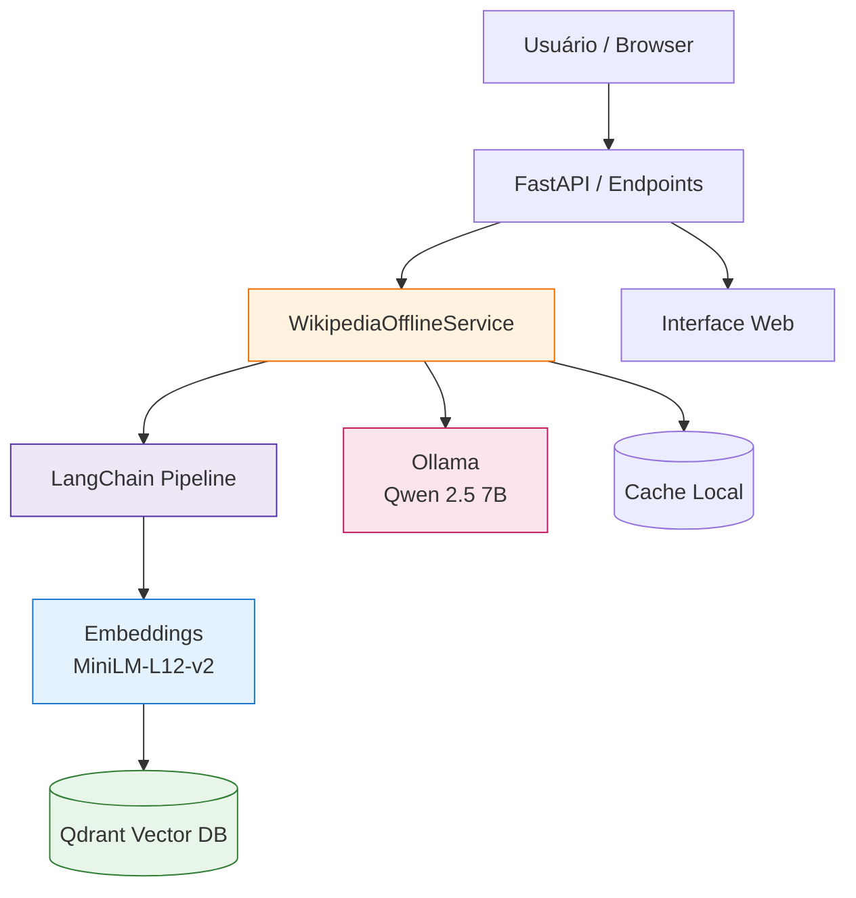

#  Sistema RAG Offline - Wikipedia + LangChain + Ollama

Sistema completo de **Retrieval-Augmented Generation (RAG)** offline utilizando Wikipedia, Qdrant (vetores), LangChain (pipeline) e LLM local via Ollama.

[](https://fastapi.tiangolo.com/) [](https://www.python.org/) [](https://www.docker.com/) [](https://qdrant.tech/) [](https://langchain.com/)

---

##  Visão Geral

Um assistente que responde perguntas usando artigos da Wikipedia como base factual combinados com geração por LLM local. Tudo roda offline depois da ingestão inicial.

###  Funcionalidades Principais

-  Busca semântica multilíngue (pt/en) com embeddings `paraphrase-multilingual-MiniLM-L12-v2`
-  Respostas RAG contextualizadas (Qwen 2.5 7B via Ollama)
-  Adição dinâmica de artigos da Wikipedia
-  Ingestão em chunks (configurável) com LangChain
-  Armazenamento persistente em Qdrant (vetores 384d)
-  API REST + interface web estática
-  48 testes unitários (100% passando)
-  100% offline após ingestão

---

##  Arquitetura



### Fluxo Resumido

1. Pergunta  embeddings  busca vetorial  contexto  prompt  LLM  resposta
2. Adição de artigo  fetch  limpeza  chunking  embeddings  armazenamento

---

##  Início Rápido

```bash
git clone https://github.com/ekotuja-AI/dicionario_vetorial.git
cd dicionario_vetorial
docker-compose up -d
docker-compose logs -f
```

Após ~2 minutos: acesse http://localhost:9000

Teste rápido:
```bash
curl -X POST http://localhost:9000/perguntar \
  -H 'Content-Type: application/json' \
  -d '{"pergunta": "O que é Python?"}'
```

---

##  Endpoints Principais

| Método | Rota | Função |
|--------|------|--------|
| POST | /buscar | Busca semântica |
| POST | /perguntar | Pergunta usando RAG |
| POST | /adicionar | Adiciona artigo da Wikipedia |
| GET  | /estatisticas | Métricas (chunks, artigos) |
| GET  | /status | Saúde do sistema |

Exemplo busca:
```bash
curl -X POST http://localhost:9000/buscar \
 -H 'Content-Type: application/json' \
 -d '{"query":"inteligência artificial","limite":5}'
```

---

##  Testes

```bash
python -m pytest tests/ -v
python -m pytest tests/ --cov=api --cov=services --cov-report=term-missing
```

Resultado esperado:
```
48 passed in ~3.5s
```

---

##  Configuração (.env)

```env
QDRANT_HOST=qdrant
QDRANT_PORT=6333
COLLECTION_NAME=wikipedia_pt
OLLAMA_HOST=ollama
OLLAMA_PORT=11434
LLM_MODEL=qwen2.5:7b
EMBEDDING_MODEL=paraphrase-multilingual-MiniLM-L12-v2
EMBEDDING_SIZE=384
API_PORT=9000
CHUNK_SIZE=500
CHUNK_OVERLAP=50
```

Principais ajustes (`services/wikipediaOfflineService.py`):
```python
score_threshold = 0.5      # Similaridade mínima (0.3-0.7)
max_chunks = 5             # Contexto usado no prompt
temperature = 0.8          # Criatividade
num_predict = 800          # Tokens máximos
```

---

##  Estrutura

```
├── api/              # Endpoints FastAPI e models
├── services/         # Lógica RAG, ingestão e Wikipedia
├── static/           # Interface web (index.html, artigos.html)
├── scripts/          # Scripts utilitários e auxiliares
├── data/             # Dumps Wikipedia, artigos e cache
├── docs/             # Documentação técnica
├── docker/           # Arquivos Docker alternativos
├── tests/            # Suite principal de testes (48 testes)
├── tests_temp/       # Scripts de teste e debug temporários
├── models/           # Modelos baixados (ML/embedding)
├── Dockerfile        # Build da aplicação
├── docker-compose.yml # Orquestração (app + ollama + qdrant)
├── requirements_minimal.txt
└── pytest.ini
```

---

##  Docker

```bash
docker-compose up -d
docker-compose logs -f app
docker-compose restart app
docker-compose down
```

Shell rápido:
```bash
docker exec -it offline_wikipedia_app bash
docker exec -it offline_wikipedia_ollama bash
```

---

##  Troubleshooting

| Problema | Causa | Solução |
|----------|-------|---------|
| Busca vazia | threshold alto / sem dados | Reduza para 0.3 e adicione artigos |
| Resposta genérica | pouco contexto | Aumente max_chunks para 8 |
| Ollama falha | modelo não baixado | `docker exec ollama ollama pull qwen2.5:7b` |
| Testes falham | dependências | reinstale requirements / verifique versões |

Status rápido:
```bash
curl http://localhost:9000/status
curl http://localhost:9000/estatisticas
```

---

##  Roadmap Resumido

- v1.0: RAG básico, busca semântica
- v1.1: Prompt otimizado, testes
- v1.2: Ajuste threshold, scripts utilitários
- Próximo: cache Redis, reranking, histórico perguntas
- Futuro: multi-coleções, PDF, streaming de respostas

---