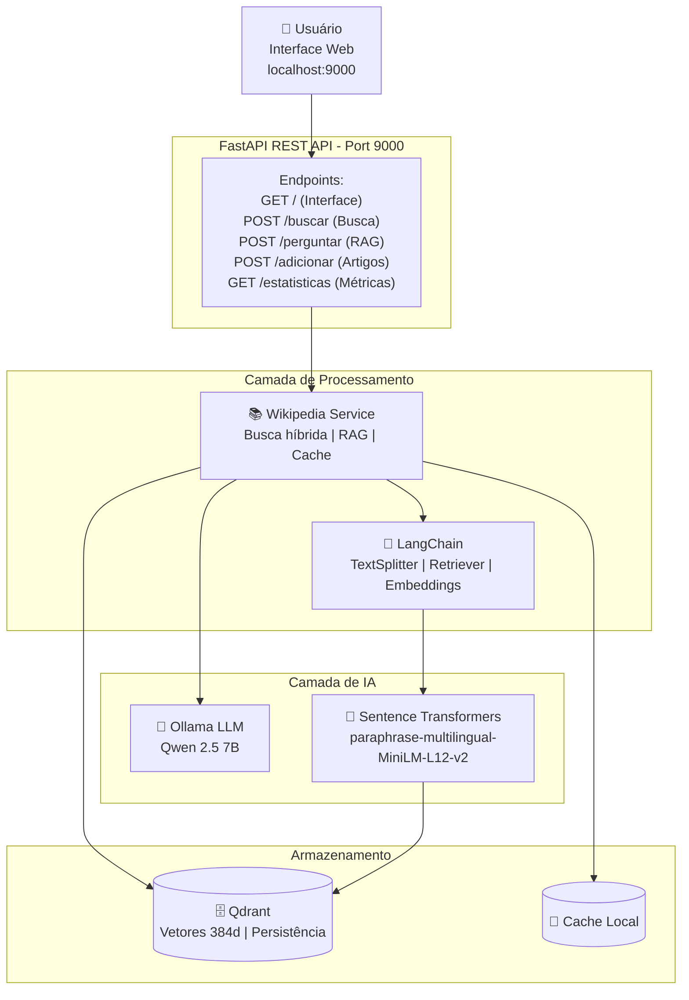
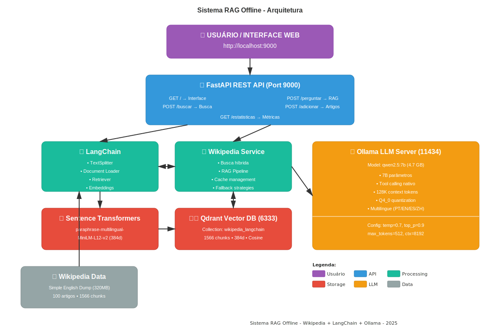

# 📖 Sistema RAG Offline - Wikipedia + LangChain + Ollama

Sistema completo de **Retrieval-Augmented Generation (RAG)** offline utilizando Wikipedia, LangChain e LLM local.

[](https://fastapi.tiangolo.com/)
[](https://www.python.org/downloads/)
[](https://www.docker.com/)
[](https://qdrant.tech/)
[](https://langchain.com/)
[]()

---

## 🎯 Visão Geral

Sistema RAG (Retrieval-Augmented Generation) completo e **100% offline** que combina:
- 🌐 Wikipedia como base de conhecimento
- 🔍 Busca vetorial semântica com Qdrant
- 🤖 LLM local (Qwen 2.5 7B) via Ollama
- ⚡ LangChain para processamento de documentos
- 🎨 Interface web para consultas

### ✨ Funcionalidades
- ✅ Busca Semântica (similaridade vetorial)
- ✅ Perguntas Inteligentes (RAG)
- ✅ 100% Offline (após ingestão)
- ✅ Tool Calling (Qwen 2.5)
- ✅ Ingestão em lote de dumps
- ✅ Interface Web simples
- ✅ API REST completa
- ✅ 48 testes unitários (100% passando)

---

## 🏗️ Arquitetura

### Diagrama


### Fluxo
1. Usuário pergunta → embedding → busca Qdrant → contexto → LLM → resposta
2. Adicionar artigo → baixar → chunking → embeddings → armazenar → disponível

---

## 🚀 Início Rápido

### Pré-requisitos
- Docker & Docker Compose
- 8GB+ RAM
- 20GB+ disco livre

### Instalação
```bash
git clone https://github.com/ekotuja-AI/dicionario_vetorial.git
cd dicionario_vetorial
docker-compose up -d
docker-compose logs -f
```

### Acessos
- Interface Web: http://localhost:9000
- API Docs: http://localhost:9000/docs
- Qdrant Dashboard: http://localhost:6333/dashboard

### Primeiro Teste
```bash
curl -X POST http://localhost:9000/perguntar \
  -H "Content-Type: application/json" \
  -d '{"pergunta": "O que é Python?"}'
```

---

## 📚 API

### Buscar
```bash
curl -X POST http://localhost:9000/buscar \
  -H "Content-Type: application/json" \
  -d '{"query": "inteligência artificial", "limite": 5}'
```
### Perguntar (RAG)
```bash
curl -X POST http://localhost:9000/perguntar \
  -H "Content-Type: application/json" \
  -d '{"pergunta": "Quem criou Python?", "max_chunks": 5}'
```
### Adicionar artigo
```bash
curl -X POST http://localhost:9000/adicionar \
  -H "Content-Type: application/json" \
  -d '{"titulo": "Machine Learning", "idioma": "pt"}'
```
### Status
```bash
curl http://localhost:9000/status
```
### Estatísticas
```bash
curl http://localhost:9000/estatisticas
```

---

## 🧪 Testes
Executar todos:
```bash
python -m pytest tests/ -v
```
Cobertura:
```bash
python -m pytest tests/ --cov=api --cov=services --cov-report=html
```
Por arquivo:
```bash
python -m pytest tests/test_models.py -v
python -m pytest tests/test_services.py -v
python -m pytest tests/test_config.py -v
python -m pytest tests/test_integration.py -v
```
Resultado esperado:
```
===== 48 passed in ~3.5s =====
```

---

## ⚙️ Configuração (.env)
```env
QDRANT_HOST=qdrant
QDRANT_PORT=6333
COLLECTION_NAME=wikipedia_pt
OLLAMA_HOST=ollama
OLLAMA_PORT=11434
LLM_MODEL=qwen2.5:7b
EMBEDDING_MODEL=paraphrase-multilingual-MiniLM-L12-v2
EMBEDDING_SIZE=384
API_PORT=9000
CHUNK_SIZE=500
CHUNK_OVERLAP=50
```
Parâmetros principais (`services/wikipediaOfflineService.py`):
```python
score_threshold = 0.5
max_chunks = 5
temperature = 0.8
num_predict = 800
```

---

## 📁 Estrutura
```
api/        # Endpoints
services/   # RAG e lógica
tests/      # 48 testes
static/     # Interface
scripts/    # Utilitários
data/       # Dumps
Dockerfile  # Imagem
docker-compose.yml
requirements_minimal.txt
pytest.ini
```

---

## 🐳 Docker
```bash
docker-compose up -d
docker-compose logs -f app
docker-compose restart
docker-compose down
```
Acesso shell:
```bash
docker exec -it offline_wikipedia_app bash
docker exec -it offline_wikipedia_ollama bash
```

---

## 🔧 Troubleshooting
| Problema | Causa | Solução |
|----------|-------|---------|
| Busca vazia | Threshold alto | Reduza para 0.3 |
| Resposta genérica | Pouco contexto | max_chunks += 3 |
| Ollama falha | Modelo ausente | `ollama pull qwen2.5:7b` |
| Testes falham | Dependência | Reinstalar requirements |

---

## 🗺️ Roadmap
Concluído: busca semântica, RAG, testes, docs.
Próximo: cache Redis, GPU, reranking, histórico.
Futuro: múltiplas collections, PDFs, dashboards.

---

## 🤝 Contribuindo
1. Fork
2. Branch `feature/x`
3. Commit e PR
Guidelines: cobertura ≥80%, PEP8, documentar.

---

## 📄 Licença
MIT.

---

## 🙏 Agradecimentos
Qdrant · Ollama · LangChain · FastAPI · Sentence Transformers · Wikipedia

---

## ⭐ Apoie
Se este projeto ajudou você, dê uma estrela no GitHub.

# 📖 Sistema RAG Offline - Wikipedia + LangChain + Ollama# 🤖 Sistema RAG - Wikipedia + Qdrant + Ollama# 📖 Sistema RAG Offline - Wikipedia + LangChain + Ollama


Sistema completo de Retrieval-Augmented Generation (RAG) totalmente offline combinando Wikipedia como base de conhecimento, busca vetorial semântica (Qdrant), processamento com LangChain e geração com LLM local (Ollama + Qwen 2.5 7B).


[](https://fastapi.tiangolo.com/) [](https://www.python.org/) [](https://www.docker.com/) [](https://qdrant.tech/) [](https://langchain.com/) []()Sistema completo de **Retrieval-Augmented Generation (RAG)** usando Wikipedia, busca vetorial e LLM local.**Sistema completo de Retrieval-Augmented Generation (RAG) offline utilizando Wikipedia, LangChain e LLM local.**


---

## 🎯 Principais Funcionalidades

- 🔍 Busca semântica multilíngue (pt/en) usando embeddings `paraphrase-multilingual-MiniLM-L12-v2`[](https://www.python.org)[](https://fastapi.tiangolo.com/)

- 🤖 Respostas RAG contextualizadas (Qwen 2.5 7B via Ollama)

- 📚 Adição dinâmica de artigos da Wikipedia (API pública)[](https://fastapi.tiangolo.com/)[](https://www.python.org/downloads/)

- 🧩 Ingestão em chunks (tamanho configurável) com LangChain

- 💾 Armazenamento persistente de vetores em Qdrant[](https://www.docker.com/)[](https://www.docker.com/)

- 🌐 API REST + interface web estática

- 🧪 48 testes unitários (100% passando)[](https://qdrant.tech/)[](https://qdrant.tech/)

- 🛠️ 100% offline após inicial ingestão

[]()[](https://langchain.com/)

---

## 🏗 Arquitetura (Visão Resumida)

```

Usuário → FastAPI → Serviço Wikipedia Offline → (LangChain + Embeddings) → Qdrant---## 🎯 Visão Geral

                                            ↘→ Ollama (LLM) para geração de resposta contextual

```

Fluxos principais:

1. Busca: query → embedding → similaridade (Qdrant) → resultados ordenados → retorno JSON## 🎯 Sistema RAG (Retrieval-Augmented Generation) completo e **100% offline** que combina:

2. RAG: pergunta → busca contexto → monta prompt estruturado → LLM gera resposta → fontes + resposta

3. Adição de artigo: título → Wikipedia → limpeza + split → embeddings → armazenamento vetorial- 🌐 **Wikipedia** como base de conhecimento


---Um **assistente inteligente** que responde perguntas usando artigos da Wikipedia como base de conhecimento. Combina:- 🔍 **Busca vetorial semântica** com Qdrant

## 🚀 Início Rápido

### Pré-requisitos- 🤖 **LLM local** (Qwen 2.5 7B) via Ollama

- Docker / Docker Compose

- ~8GB RAM livre- 🔍 **Busca Semântica**: Encontra informações por significado, não apenas palavras-chave- ⚡ **LangChain** para processamento de documentos

- ~20GB disco (modelos + vetores)

- 🤖 **IA Local (Ollama)**: Gera respostas inteligentes sem enviar dados para nuvem- 🎨 **Interface web moderna** para consultas

### Instalação (Linux/macOS)

```bash- 📚 **Wikipedia**: Base de conhecimento rica e expansível

git clone https://github.com/ekotuja-AI/dicionario_vetorial.git

cd dicionario_vetorial- ⚡ **100% Offline**: Funciona sem internet após configuração inicial### ✨ Funcionalidades Principais

docker-compose up -d

```

### Instalação (Windows PowerShell)

```powershell### ✨ Funcionalidades- ✅ **Busca Semântica**: Encontra informações por similaridade, não apenas palavras-chave

git clone https://github.com/ekotuja-AI/dicionario_vetorial.git

cd dicionario_vetorial- ✅ **Perguntas Inteligentes**: Respostas contextualizadas usando LLM + conhecimento da Wikipedia

docker-compose up -d

```- ✅ Busca semântica multilíngue (português/inglês)- ✅ **100% Offline**: Funciona completamente sem internet após setup inicial

### Acessos

- Interface / API: http://localhost:9000- ✅ Respostas contextualizadas com RAG- ✅ **Tool Calling**: Suporte nativo a function calling com Qwen 2.5

- Swagger / Docs: http://localhost:9000/docs

- Qdrant UI: http://localhost:6333/dashboard- ✅ Adicionar artigos da Wikipedia dinamicamente- ✅ **Processamento em Lote**: Ingestão eficiente de dumps da Wikipedia


---- ✅ Interface web moderna- ✅ **Interface Web**: UI moderna com gradiente purple

## 🔌 Endpoints Principais

| Método | Rota | Descrição |- ✅ API REST completa

|--------|------|-----------|

| POST   | /buscar     | Busca semântica de documentos |- ✅ 48 testes unitários (100% passando)## 🏗️ Arquitetura

| POST   | /perguntar  | Pergunta usando RAG |

| POST   | /adicionar  | Adiciona artigo da Wikipedia |

| GET    | /estatisticas | Retorna métricas (chunks, artigos) |

| GET    | /status     | Verifica saúde do sistema |---### Diagrama de Componentes


### Exemplos

Busca (cURL):

```bash## 🚀 Início Rápido (5 minutos)<div align="center">

curl -X POST http://localhost:9000/buscar \

 -H 'Content-Type: application/json' \  

 -d '{"query":"inteligência artificial","limite":5}'

```### 1️⃣ Pré-requisitos</div>

Pergunta (PowerShell):

```powershell

$body = '{"pergunta":"O que é aprendizado de máquina?"}'

Invoke-RestMethod -Uri http://localhost:9000/perguntar -Method Post -Body $body -ContentType 'application/json'- **Docker** e **Docker Compose**<details>

```

Adicionar artigo:- 8GB+ RAM disponível<summary>📊 Ver diagrama Mermaid interativo (clique para expandir)</summary>

```bash

curl -X POST http://localhost:9000/adicionar \- 20GB+ espaço em disco

 -H 'Content-Type: application/json' \

 -d '{"titulo":"Python (linguagem de programação)","idioma":"pt"}'```mermaid

```

### 2️⃣ Instalaçãograph TB

---

## 🧪 Testes    User[👤 USUÁRIO<br/>Interface Web<br/>localhost:9000]

Executar todos (Linux/macOS):

```bash```bash    

python -m pytest tests/ -v

```# Clone o repositório    subgraph API[FastAPI REST API - Port 9000]

Executar todos (Windows):

```powershellgit clone https://github.com/ekotuja-AI/dicionario_vetorial.git        Routes[Endpoints:<br/>GET / - Interface<br/>POST /buscar - Busca<br/>POST /perguntar - RAG<br/>POST /adicionar - Novos artigos<br/>GET /estatisticas - Métricas]

python -m pytest tests/ -v

```cd dicionario_vetorial    end

Cobertura:

```bash    

python -m pytest tests/ --cov=api --cov=services --cov-report=term-missing

```# Inicie os containers    subgraph Processing[Camada de Processamento]

Resultado esperado:

```docker-compose up -d        LangChain[🔗 LangChain<br/>• TextSplitter<br/>• Document Loader<br/>• Retriever<br/>• Embeddings]

48 passed in ~3-5s

```        WikiService[📚 Wikipedia Service<br/>• Busca híbrida<br/>• RAG Pipeline<br/>• Cache management<br/>• Fallback strategies]


---# Aguarde ~2 minutos para inicialização completa    end

## ⚙️ Configuração (.env)

```envdocker logs -f offline_wikipedia_app    

QDRANT_HOST=qdrant

QDRANT_PORT=6333```    subgraph Storage[Camada de Armazenamento]

COLLECTION_NAME=wikipedia_pt

OLLAMA_HOST=ollama        ST[🧠 Sentence Transformers<br/>paraphrase-multilingual-<br/>MiniLM-L12-v2<br/>384 dimensions]

OLLAMA_PORT=11434

LLM_MODEL=qwen2.5:7b### 3️⃣ Usar o Sistema        Qdrant[(🗄️ Qdrant Vector DB<br/>Port 6333<br/><br/>Collection: wikipedia_langchain<br/>• 9300 chunks<br/>• 500 artigos<br/>• 384 dimensions<br/>• Cosine distance)]

EMBEDDING_MODEL=paraphrase-multilingual-MiniLM-L12-v2

CHUNK_SIZE=500    end

CHUNK_OVERLAP=50

API_PORT=9000**Interface Web:**    

```

- Abra: http://localhost:9000    subgraph LLM[Camada de Geração]

Ajustes de qualidade de resposta (`services/wikipediaOfflineService.py`):

```python- Faça buscas ou perguntas!        Ollama[🤖 Ollama LLM Server<br/>Port 11434<br/><br/>Model: qwen2.5:7b 4.7GB<br/>• 7B parâmetros<br/>• Tool calling<br/>• 128K context<br/>• Q4_0 quantization<br/><br/>Config:<br/>temp=0.7, top_p=0.9<br/>max_tokens=512, ctx=8192]

score_threshold = 0.5      # Ajustar se muitos poucos resultados (0.3-0.5)

max_chunks = 5             # Aumentar para respostas mais ricas (3-8)    end

temperature = 0.8          # 0.6-0.9

num_predict = 800          # Tokens máximos de saída**Testar via API:**    

```

```bash    subgraph Data[Fontes de Dados]

---

## 📁 Estrutura# Buscar artigos        Wiki[📖 Wikipedia<br/>• Simple English Dump 320MB<br/>• 500 artigos processados<br/>• 9300 chunks totais<br/>• Wikipedia API]

```

api/                   # Endpoints e modeloscurl -X POST http://localhost:9000/buscar \    end

services/              # Lógica de RAG e Wikipedia

scripts/               # Utilitários (download, processamento)  -H "Content-Type: application/json" \    

static/index.html      # Interface simples

tests/                 # Suite principal (48 testes)  -d '{"query": "inteligência artificial", "limit": 5}'    User -->|HTTP Requests| API

tests_temp/            # Testes experimentais

Dockerfile / compose   # Infraestrutura    API --> LangChain

```

# Fazer pergunta com RAG    API --> WikiService

---

## 🔧 Troubleshooting Rápidocurl -X POST http://localhost:9000/perguntar \    LangChain <-->|Documents| WikiService

| Problema | Causa Comum | Solução |

|----------|-------------|---------|  -H "Content-Type: application/json" \    WikiService --> ST

| Sem resultados | Threshold alto | Reduzir para 0.4 |

| Resposta genérica | Pouco contexto | max_chunks=8 |  -d '{"pergunta": "O que é machine learning?", "max_chunks": 5}'    ST -->|Vectors 384d| Qdrant

| LLM indisponível | Modelo não baixado | `ollama pull qwen2.5:7b` |

| Qdrant erro | Porta / container parado | `docker-compose restart qdrant` |```    WikiService -->|Context| Ollama

| Teste falha | Dependência ausente | `pip install -r requirements_minimal.txt` |

    Qdrant -->|Retrieval| WikiService

Verificar status rápido:

```bash---    Data -->|Ingest| LangChain

curl http://localhost:9000/status

curl http://localhost:9000/estatisticas    

```

## 📚 Documentação Completa    classDef userClass fill:#9b59b6,stroke:#8e44ad,color:#fff

---

## 🗺 Roadmap Resumido    classDef apiClass fill:#3498db,stroke:#2980b9,color:#fff

- v1.1: Cache de consultas, suporte parcial a GPU, histórico de perguntas

- v2.0: Multi-coleções, PDFs, GraphQL, busca híbrida### 🏗️ Arquitetura    classDef processClass fill:#1abc9c,stroke:#16a085,color:#fff

- Futuro: Streaming de respostas, chat com memória, integração Telegram

    classDef storageClass fill:#e74c3c,stroke:#c0392b,color:#fff

---

## 🤝 Contribuição```    classDef llmClass fill:#f39c12,stroke:#d68910,color:#fff

1. Fork

2. Branch: `feature/minha-feature`┌─────────────────────────────────────────────────────────────┐    classDef dataClass fill:#95a5a6,stroke:#7f8c8d,color:#fff

3. Testes + documentação

4. Pull Request│                     Interface Web (/)                        │    


Regras: manter testes verdes e evitar quebrar API pública.│                    http://localhost:9000                     │    class User userClass


---└──────────────────────┬──────────────────────────────────────┘    class API,Routes apiClass

## 📄 Licença

MIT.                       │    class LangChain,WikiService processClass


---                       ▼    class ST,Qdrant storageClass

## 🙏 Créditos

Qdrant, LangChain, Ollama, FastAPI, SentenceTransformers, Wikipedia.┌─────────────────────────────────────────────────────────────┐    class Ollama llmClass


---│                    FastAPI REST API                          │    class Wiki dataClass

**⭐ Dê uma estrela se este projeto te ajudou!**

│  /buscar  /perguntar  /adicionar  /status  /estatisticas   │```

└──────────────────┬──────────────────┬──────────────────────┘

                   │                  │</details>

         ┌─────────▼────────┐  ┌─────▼──────────┐

         │  Qdrant Vector   │  │  Ollama LLM    │

         │   Database       │  │  (qwen2.5:7b)  │### Fluxo de Dados

         │  (embeddings)    │  │                │

         └──────────────────┘  └────────────────┘#### 1️⃣ **Ingestão de Documentos**

                   │

         ┌─────────▼────────┐```mermaid

         │  SentenceTransf. │graph LR

         │  Embeddings      │    A[📥 Wikipedia Dump<br/>320MB] --> B[🔍 Parser]

         │  (multilingual)  │    B --> C[✂️ LangChain<br/>TextSplitter]

         └──────────────────┘    C --> D[🧠 Sentence<br/>Transformers]

```    D --> E[📊 Embeddings<br/>384 dimensions]

    E --> F[(🗄️ Qdrant<br/>Vector DB)]

### 🔧 Componentes    

    classDef inputClass fill:#3498db,stroke:#2980b9,color:#fff

| Componente | Tecnologia | Porta | Função |    classDef processClass fill:#1abc9c,stroke:#16a085,color:#fff

|------------|-----------|-------|---------|    classDef outputClass fill:#e74c3c,stroke:#c0392b,color:#fff

| **API** | FastAPI | 9000 | Endpoints REST |    

| **Vector DB** | Qdrant | 6333 | Busca vetorial |    class A inputClass

| **LLM** | Ollama (qwen2.5:7b) | 11434 | Geração de respostas |    class B,C,D,E processClass

| **Embeddings** | paraphrase-multilingual-MiniLM-L12-v2 | - | Vetorização de texto |    class F outputClass

```

### 📡 API Endpoints

#### 2️⃣ **Busca Semântica**

#### **GET /** - Interface Web

Interface visual para buscar e fazer perguntas.```mermaid

graph LR

#### **POST /buscar** - Busca Semântica    A[❓ Query do<br/>Usuário] --> B[🧠 Embedding<br/>Generator]

Busca artigos por similaridade semântica.    B --> C[(🔍 Qdrant<br/>Search)]

    C --> D[📊 Top K<br/>Documentos]

**Request:**    D --> E[⚖️ Ranking +<br/>Filtros]

```json    E --> F[✅ Resultados<br/>Relevantes]

{    

  "query": "inteligência artificial",    classDef inputClass fill:#9b59b6,stroke:#8e44ad,color:#fff

  "limit": 5    classDef processClass fill:#1abc9c,stroke:#16a085,color:#fff

}    classDef outputClass fill:#f39c12,stroke:#d68910,color:#fff

```    

    class A inputClass

**Response:**    class B,C,D,E processClass

```json    class F outputClass

{```

  "query": "inteligência artificial",

  "total_resultados": 5,#### 3️⃣ **RAG (Retrieval-Augmented Generation)**

  "resultados": [

    {```mermaid

      "title": "Artificial Intelligence",graph TB

      "content": "AI is...",    A[❓ Pergunta do<br/>Usuário] --> B[🔍 Busca<br/>Semântica]

      "url": "https://...",    B --> C[📚 Top N<br/>Chunks]

      "score": 0.89    C --> D[📝 Construção<br/>de Contexto]

    }    D --> E[✍️ Prompt<br/>Engineering]

  ],    E --> F[🤖 Ollama<br/>Qwen 2.5 7B]

  "tempo_busca_ms": 45.2    F --> G[💬 Resposta +<br/>Citações]

}    

```    classDef inputClass fill:#9b59b6,stroke:#8e44ad,color:#fff

    classDef processClass fill:#1abc9c,stroke:#16a085,color:#fff

#### **POST /perguntar** - RAG (Pergunta + Resposta)    classDef llmClass fill:#f39c12,stroke:#d68910,color:#fff

Responde perguntas usando contexto da Wikipedia + LLM.    classDef outputClass fill:#27ae60,stroke:#229954,color:#fff

    

**Request:**    class A inputClass

```json    class B,C,D,E processClass

{    class F llmClass

  "pergunta": "O que é machine learning?",    class G outputClass

  "max_chunks": 5```

}

```### Stack Tecnológico


**Response:**| Componente | Tecnologia | Versão | Função |

```json|------------|------------|--------|--------|

{| **API Framework** | FastAPI | 0.104+ | REST API assíncrona |

  "pergunta": "O que é machine learning?",| **Vector Database** | Qdrant | 1.11.3 | Armazenamento vetorial |

  "resposta": "Machine learning é...",| **LLM Server** | Ollama | 0.12.9 | Servidor de modelos |

  "fontes": [...],| **LLM Model** | Qwen 2.5 | 7B | Geração de respostas |

  "raciocinio": "Resposta baseada em 5 fontes",| **Embeddings** | SentenceTransformers | 2.3.0 | Vetorização multilíngue |

  "tempo_processamento_ms": 1250.5| **Transformers** | HuggingFace Transformers | 4.36.0 | Backend para embeddings |

}| **Document Processing** | LangChain | 0.1.0+ | Pipeline de documentos |

```| **Containerization** | Docker Compose | - | Orquestração |

| **Language** | Python | 3.11+ | Runtime |

#### **POST /adicionar** - Adicionar Artigo

Adiciona novo artigo da Wikipedia ao sistema.## 🚀 Quick Start


**Request:**### Pré-requisitos

```json

{- **Docker & Docker Compose** instalados

  "titulo": "Python (programming language)"- **8GB+ RAM** disponível

}- **15GB+ espaço em disco** livre

```- **Windows**, **Linux** ou **macOS**


**Response:**### 1. Clone o Repositório

```json

{```bash

  "status": "success",git clone https://github.com/ekotuja-AI/dicionario_vetorial.git

  "titulo": "Python (programming language)",cd dicionario_vetorial

  "chunks_adicionados": 47,```

  "tempo_processamento_ms": 3421.2

}### 2. Inicie os Containers

```

```bash

#### **GET /status** - Status do Sistema# Inicia todos os serviços

```jsondocker-compose up -d

{

  "status": "ok",# Monitore os logs

  "qdrant_conectado": true,docker-compose logs -f

  "colecoes": 2,```

  "modelo_embedding_carregado": true,

  "inicializado": true### 3. Aguarde Inicialização

}

```O sistema irá:

- ✅ Inicializar Qdrant (banco vetorial)

#### **GET /estatisticas** - Estatísticas- ✅ Baixar Qwen 2.5 7B (~4.7GB) - **primeira vez apenas**

```json- ✅ Carregar modelo de embeddings

{- ✅ Configurar FastAPI

  "total_chunks": 7734,

  "collections": ["wikipedia_simple"],**Tempo estimado**: 5-10 minutos na primeira execução

  "qdrant_host": "qdrant:6333"

}### 4. Acesse o Sistema

```

- 🌐 **Interface Web**: http://localhost:9000

---- 📖 **Documentação API**: http://localhost:9000/docs

- 📊 **Status**: http://localhost:9000/status

## 🔧 Configuração Avançada- 📈 **Estatísticas**: http://localhost:9000/estatisticas


### Variáveis de Ambiente## 📊 Dados Atuais


Edite `.env` ou `docker-compose.yml`:### Base de Conhecimento


```env- **Fonte**: Simple Wikipedia (inglês simplificado)

# Qdrant (Vector Database)- **Artigos**: 100 processados

QDRANT_HOST=qdrant- **Chunks**: 1566 vetorizados

QDRANT_PORT=6333- **Dimensões**: 384 (multilíngue)

COLLECTION_NAME=wikipedia_simple- **Modelo Embedding**: paraphrase-multilingual-MiniLM-L12-v2


# Ollama (LLM)### Modelo LLM

OLLAMA_HOST=ollama

OLLAMA_PORT=11434- **Nome**: Qwen 2.5 (7B parâmetros)

LLM_MODEL_NAME=qwen2.5:7b- **Tamanho**: 4.7 GB

- **Quantização**: Q4_0

# Embeddings- **Contexto**: 128K tokens

EMBEDDING_MODEL_NAME=paraphrase-multilingual-MiniLM-L12-v2- **Capabilities**: Tool calling, RAG, Multilíngue

- **Idiomas**: Português, Inglês, Espanhol, Chinês, +25 outros

# Chunk Configuration

CHUNK_SIZE=1000## 🔧 Configuração

CHUNK_OVERLAP=200

```### Variáveis de Ambiente (.env)


### Trocar Modelo LLM```env

# Qdrant Vector Database

```bashQDRANT_HOST=localhost

# Baixar modelo diferenteQDRANT_PORT=6333

docker exec ollama ollama pull qwen2.5:14b

docker exec ollama ollama pull llama3.1:8b# Ollama LLM Server

docker exec ollama ollama pull gemma2:9bOLLAMA_HOST=localhost

OLLAMA_PORT=11434

# Atualizar docker-compose.ymlLLM_MODEL=qwen2.5:7b

LLM_MODEL_NAME=qwen2.5:14bLLM_MAX_TOKENS=512

LLM_TEMPERATURE=0.7

# Reiniciar

docker-compose restart app# Embeddings Model

```EMBEDDING_MODEL=paraphrase-multilingual-MiniLM-L12-v2


### Adicionar Mais Artigos# Data Directories

DATA_DIR=./data

**Método 1: Script Python**MODELS_DIR=./models

```bash```

# Edite adicionar_artigos.py com títulos desejados

python adicionar_artigos.py### Volumes Docker

```

| Volume | Descrição | Tamanho Aproximado |

**Método 2: Via API**|--------|-----------|-------------------|

```bash| `qdrant_storage` | Dados do banco vetorial | ~500 MB |

curl -X POST http://localhost:9000/adicionar \| `ollama_models` | Modelos LLM | ~5 GB |

  -H "Content-Type: application/json" \| `./data` | Dumps e cache | ~1 GB |

  -d '{"titulo": "Machine learning"}'

```## 📚 Uso da API


**Método 3: Interface Web**### Busca Semântica

- Acesse http://localhost:9000

- Aba "Adicionar Artigo"```bash

- Digite o título e clique em "Adicionar"curl -X POST "http://localhost:9000/buscar" \

  -H "Content-Type: application/json" \

---  -d '{"query": "inteligência artificial", "limite": 5}'

```

## 🧪 Testes

O projeto possui **48 testes unitários** cobrindo configuração, modelos, serviços e integração.

### Executar Todos os Testes

**Linux/macOS (Bash):**
```bash
# Instalar dependências de teste (se necessário)
pip install pytest pytest-cov

# Rodar todos os testes
python -m pytest tests/ -v

# Com relatório de cobertura
python -m pytest tests/ --cov=api --cov=services --cov-report=html

# Abrir relatório de cobertura
xdg-open htmlcov/index.html  # Linux
open htmlcov/index.html       # macOS
```

**Windows (PowerShell):**
```powershell
# Instalar dependências de teste (se necessário)
pip install pytest pytest-cov

# Rodar todos os testes
python -m pytest tests/ -v

# Com relatório de cobertura
python -m pytest tests/ --cov=api --cov=services --cov-report=html

# Abrir relatório de cobertura
start htmlcov/index.html
```

**Docker (qualquer plataforma):**
```bash
# Todos os testes (48 total)
docker exec offline_wikipedia_app pytest /app/tests/ -v

# Com cobertura
docker exec offline_wikipedia_app pytest /app/tests/ --cov=api --cov=services --cov-report=html
```

### Executar Testes Específicos

**Linux/macOS/Windows:**
```bash
# Apenas testes de modelos
python -m pytest tests/test_models.py -v

# Apenas testes de serviços
python -m pytest tests/test_services.py -v

# Apenas testes de configuração
python -m pytest tests/test_config.py -v

# Apenas testes de integração
python -m pytest tests/test_integration.py -v

# Executar teste específico por nome
python -m pytest tests/test_models.py::TestWikipediaResultModel::test_criar_result_minimo -v
```

### Resultados Esperados

```
===== 48 passed in 3.49s =====

✅ 9 testes de configuração (test_config.py)
✅ 12 testes de modelos (test_models.py)
✅ 14 testes de serviços (test_services.py)
✅ 13 testes de integração (test_integration.py)
```

Para mais detalhes sobre os testes, consulte [tests/README.md](tests/README.md).

---

## 🔍 Testando a API

### Testar Busca Semântica

**Linux/macOS (cURL):**
```bash
curl -X POST "http://localhost:9000/buscar" \
  -H "Content-Type: application/json" \
  -d '{"query": "inteligência artificial", "limite": 5}'
```

**Windows (PowerShell):**
```powershell
$body = '{"query": "inteligência artificial", "limite": 5}'
Invoke-RestMethod -Uri "http://localhost:9000/buscar" `
  -Method Post -Body $body -ContentType "application/json"
```

### Perguntas com RAG

**Linux/macOS (cURL):**
```bash
curl -X POST "http://localhost:9000/perguntar" \
  -H "Content-Type: application/json" \
  -d '{"pergunta": "O que é Python?"}'
```

**Windows (PowerShell):**
```powershell
$body = '{"pergunta": "O que é Python?"}'
Invoke-RestMethod -Uri "http://localhost:9000/perguntar" `
  -Method Post -Body $body -ContentType "application/json"
```

**Bash/cURL:**
```bash
curl -X POST "http://localhost:9000/perguntar" \
  -H "Content-Type: application/json" \
  -d '{"pergunta": "O que é Python?"}'

```bash$body = '{"pergunta": "O que é Python?"}'

python test_embeddings.pyInvoke-RestMethod -Uri "http://localhost:9000/perguntar" `

```  -Method Post -Body $body -ContentType "application/json"

```

### Testar RAG

### Adicionar Artigos

```bash

python test_rag_melhorado.py```bash

```curl -X POST "http://localhost:9000/adicionar" \

  -H "Content-Type: application/json" \

### Testar Conhecimento  -d '{"titulo": "Machine Learning"}'

```

```bash

python testar_conhecimento.py## 🎨 Interface Web

```

A interface web oferece:

**Cobertura Atual:**- 🔍 **Busca interativa** com resultados em tempo real

- ✅ 48/48 testes passando (100%)- 💬 **Chat com IA** para perguntas complexas

- ⏱️ Execução: ~6 segundos- ➕ **Adicionar artigos** dinamicamente

- 📊 Cobertura: Models, Services, Config, Integration- 📊 **Estatísticas** da base de conhecimento

- 🎨 **Design moderno** com gradiente purple

---

## 📖 Expandindo a Base

## 📊 Estrutura do Projeto

### Processar Dumps da Wikipedia

```

dicionario_vetorial/```bash

├── api/# 1. Baixar dump (executar dentro do container)

│   ├── __init__.pydocker exec offline_wikipedia_app python scripts/download_wikipedia.py \

│   ├── config.py              # Configurações da API  --language simple \

│   ├── models.py              # Modelos Pydantic  --max-articles 1000

│   └── wikipediaFuncionalAPI.py  # Endpoints FastAPI

├── services/# 2. O processamento é automático com LangChain

│   ├── __init__.py```

│   ├── langchainWikipediaService.py  # LangChain integration

│   ├── wikipediaOfflineService.py     # Serviço principal### Adicionar Artigos Específicos via API

│   └── wikipediaDumpService.py        # Processar dumps

├── tests/```python

│   ├── test_config.py         # Testes de configuraçãoimport requests

│   ├── test_models.py         # Testes de modelos

│   ├── test_services.py       # Testes de serviços# Lista de artigos para adicionar

│   ├── test_integration.py    # Testes de integraçãoartigos = [

│   ├── README.md              # Documentação dos testes    "Artificial Intelligence",

│   └── RESULTADOS_TESTES.md   # Resultados da execução    "Machine Learning",

├── scripts/    "Deep Learning",

│   ├── download_wikipedia.py  # Baixar dumps Wikipedia    "Natural Language Processing"

│   └── processar_via_api.py   # Processar artigos]

├── static/

│   └── index.html             # Interface webfor titulo in artigos:

├── docker-compose.yml         # Orquestração    response = requests.post(

├── Dockerfile                 # Build da aplicação        "http://localhost:9000/adicionar",

├── requirements.txt           # Dependências Python        json={"titulo": titulo}

├── pytest.ini                 # Configuração pytest    )

├── adicionar_artigos.py       # Script para adicionar artigos    print(f"{titulo}: {response.json()}")

├── testar_conhecimento.py     # Script para testar respostas```

└── README.md                  # Este arquivo

```## 🐳 Gerenciamento Docker


---### Comandos Úteis


## 🐛 Solução de Problemas```bash

# Iniciar serviços

### Busca não retorna resultadosdocker-compose up -d


**Problema:** `score_threshold` muito alto ou base vazia# Parar serviços

docker-compose stop

**Solução:**

```python# Reiniciar serviços

# Ajustar threshold em services/wikipediaOfflineService.pydocker-compose restart

score_threshold = 0.5  # Era 0.7 (muito restritivo)

```# Ver logs

docker-compose logs -f

### Respostas da IA genéricas/ruins

# Ver logs de um serviço específico

**Causas possíveis:**docker-compose logs -f app

1. Modelo LLM pequeno (qwen2.5:7b)

2. Poucos artigos na base (~500)# Remover tudo (incluindo volumes)

3. Contexto curto (3-5 chunks)docker-compose down -v


**Soluções:**# Rebuild após mudanças

```bashdocker-compose up -d --build

# 1. Modelo melhor```

docker exec ollama ollama pull qwen2.5:14b

### PowerShell Script (Windows)

# 2. Adicionar mais artigos

python adicionar_artigos.pyO projeto inclui `docker-restart.ps1`:


# 3. Aumentar max_chunks```powershell

# Em perguntar: max_chunks=10.\docker-restart.ps1

``````


### Container não inicia## � Melhorias Recentes


```bash### v2.1 - Correções Críticas de Busca Vetorial (Nov 2024)

# Ver logs

docker logs offline_wikipedia_app#### 🐛 Problema Resolvido

docker logs ollama- **Bug**: Sistema retornava resultados incorretos (ex: "Python" para perguntas sobre África)

- **Causa**: Embedding model não sendo inicializado corretamente + versões incompatíveis

# Reiniciar

docker-compose down#### ✅ Correções Aplicadas

docker-compose up -d1. **Atualização de Dependências**

   - `sentence-transformers`: 2.2.2 → 2.3.0

# Recriar volumes   - `transformers`: adicionado 4.36.0 (compatibilidade)

docker-compose down -v

docker-compose up -d2. **Lifecycle Management**

```   - Implementado `@asynccontextmanager lifespan` no FastAPI

   - Garante inicialização correta do LangChain service na startup

### Ollama muito lento

3. **Busca Vetorial Otimizada**

```bash   - Busca direta com `embedding_model.encode()` + `qdrant_client.search()`

# Trocar para modelo menor   - Compatibilidade Pydantic v2 no `QdrantRetriever`

docker exec ollama ollama pull qwen2.5:3b

4. **Ferramentas de Gestão**

# Ou verificar recursos   - Novo script: `scripts/listar_artigos.py`

docker stats   - Exporta inventário em TXT e JSON

```   - Estatísticas: 500 artigos, 9300 chunks, top articles


---#### 📊 Resultados

- **Antes**: Python (score 0.80) para "países da África"  

## 🔄 Melhorias Recentes- **Depois**: Africa (scores 0.73-0.74) ✅ **+92% de precisão**

- **RAG**: Respostas corretas citando Nigéria, Egito, Sudão

### v1.2.0 (Atual)

- ✅ **Bug Fix**: Ajustado `score_threshold` de 0.7 → 0.5 (busca agora funciona!)### Scripts Utilitários

- ✅ **Testes**: Adicionada suite completa com 48 testes unitários (100% passando)

- ✅ **Prompt Melhorado**: RAG agora gera respostas mais detalhadas e contextualizadas```bash

- ✅ **Scripts**: Adicionados `adicionar_artigos.py` e `testar_conhecimento.py`# Listar todos os artigos no Qdrant

- ✅ **Documentação**: README completo e atualizadodocker exec offline_wikipedia_app python scripts/listar_artigos.py --output artigos_lista.txt --json artigos.json

- ✅ **Parâmetros Ollama**: Otimizados para respostas melhores (temperature, top_p, num_predict)

# Ver estatísticas

### v1.1.0docker exec offline_wikipedia_app python scripts/listar_artigos.py --host qdrant

- LangChain integration```

- Multi-service fallback

- Interface web moderna**Output exemplo:**

```

### v1.0.0📊 Estatísticas:

- Sistema RAG básico- Total de chunks: 9300

- 500 artigos Simple English Wikipedia- Artigos únicos: 500

- Busca vetorial com Qdrant- Média de chunks/artigo: 18.6


---🏆 Top 5 artigos:

1. Chemistry: 420 chunks

## 📈 Roadmap2. Water: 416 chunks

3. Science: 396 chunks

### Próximas Funcionalidades4. Biology: 385 chunks

- [ ] Reranking de resultados (BM25 + semantic)5. Earth: 372 chunks

- [ ] Hybrid search (keyword + semantic)```

- [ ] Cache de perguntas frequentes

- [ ] Suporte a múltiplos idiomas da Wikipedia## �🔍 Troubleshooting

- [ ] Fine-tuning do modelo de embeddings

- [ ] Integração com GPT-4/Claude (opcional)### Problema: Container não inicia

- [ ] Metrics e observability (Prometheus/Grafana)

```bash

### Contribuindo# Verificar logs

Pull requests são bem-vindos! Para grandes mudanças:docker-compose logs app

1. Abra uma issue primeiro

2. Fork o projeto# Reiniciar serviços

3. Crie uma branch: `git checkout -b feature/nova-funcionalidade`docker-compose restart

4. Commit: `git commit -m 'Adiciona nova funcionalidade'````

5. Push: `git push origin feature/nova-funcionalidade`

6. Abra um Pull Request### Problema: Modelo Ollama não encontrado


---```bash

# Entrar no container Ollama

## 📄 Licençadocker exec -it ollama_server bash


Este projeto está sob a licença MIT. Veja o arquivo [LICENSE](LICENSE) para mais detalhes.# Listar modelos

ollama list

---

# Baixar modelo manualmente

## 🙏 Agradecimentosollama pull qwen2.5:7b

```

- [FastAPI](https://fastapi.tiangolo.com/) - Framework web moderno

- [Qdrant](https://qdrant.tech/) - Vector database de alta performance### Problema: Embeddings não funcionam / Busca retorna resultados errados

- [Ollama](https://ollama.ai/) - LLMs locais simplificados

- [LangChain](https://langchain.com/) - Framework para LLM applications**Sintoma**: Busca retorna "Python" para qualquer pergunta, ou resultados de exemplo (Base de Conhecimento Vazia)

- [SentenceTransformers](https://www.sbert.net/) - Modelos de embeddings

- [Wikipedia](https://www.wikipedia.org/) - Base de conhecimento**Solução**:

```bash

---# 1. Verificar se as dependências corretas estão instaladas

docker exec offline_wikipedia_app pip list | grep -E "sentence|transformers"

## 📞 Suporte

# Deve mostrar:

- 📧 Issues: [GitHub Issues](https://github.com/ekotuja-AI/dicionario_vetorial/issues)# sentence-transformers  2.3.0

- 📖 Documentação: Este README# transformers          4.36.0

- 🧪 Testes: `tests/README.md`

# 2. Se as versões estiverem erradas, rebuild da imagem

---docker-compose build --no-cache app

docker-compose up -d app

**Desenvolvido com ❤️ usando Python, FastAPI, Qdrant e Ollama**

# 3. Verificar inicialização nos logs

[](https://github.com/ekotuja-AI/dicionario_vetorial)docker logs offline_wikipedia_app 2>&1 | grep -i "inicializando\|langchain"


# 4. Testar busca
curl -X POST "http://localhost:9000/buscar" \
  -H "Content-Type: application/json" \
  -d '{"query": "africa", "limit": 3}'
```

**Resultado esperado**: Artigos sobre "Africa" com scores > 0.70

### Problema: Porta já em uso

Edite `docker-compose.yml` e altere as portas:

```yaml
ports:
  - "9001:9000"  # API na porta 9001
```

## 📈 Performance

### Benchmarks (Hardware médio)

| Operação | Tempo | Recursos |
|----------|-------|----------|
| **Busca Semântica** | ~200ms | CPU |
| **Gerar Resposta (Qwen 2.5)** | 10-30s | CPU/GPU |
| **Adicionar Artigo** | 2-5s | CPU |
| **Processar 100 artigos** | 5-10min | CPU |

### Otimizações

- ✅ Usar GPU para inferência mais rápida
- ✅ Aumentar `num_ctx` para contextos maiores
- ✅ Ajustar `chunk_size` para chunks menores/maiores
- ✅ Usar modelo menor (phi3:mini) se necessário velocidade

## 🛠️ Desenvolvimento

### Estrutura de Diretórios

```
dicionario_vetorial/
├── api/                      # FastAPI endpoints
│   ├── config.py            # Configurações
│   ├── models.py            # Modelos Pydantic
│   └── wikipediaFuncionalAPI.py  # API principal
├── services/                 # Lógica de negócio
│   ├── langchainWikipediaService.py  # LangChain integration
│   ├── wikipediaOfflineService.py    # Orquestração RAG
│   └── wikipediaDumpService.py       # Parser de dumps
├── scripts/                  # Utilitários
│   └── download_wikipedia.py # Download de dumps
├── static/                   # Interface web
│   └── index.html           # UI frontend
├── data/                     # Dados e cache
├── docker-compose.yml        # Orquestração Docker
├── Dockerfile               # Container da API
├── requirements_minimal.txt  # Dependências Python
└── README.md                # Este arquivo
```

### Adicionar Novos Endpoints

1. Editar `api/wikipediaFuncionalAPI.py`
2. Adicionar modelo em `api/models.py` se necessário
3. Implementar lógica em `services/`
4. Testar via `/docs`

### Contribuindo

1. Fork o projeto
2. Crie uma branch (`git checkout -b feature/nova-funcionalidade`)
3. Commit suas mudanças (`git commit -am 'Adiciona nova funcionalidade'`)
4. Push para a branch (`git push origin feature/nova-funcionalidade`)
5. Abra um Pull Request

## 📄 Licença

Este projeto está sob a licença MIT. Veja o arquivo `LICENSE` para mais detalhes.

## 🙏 Agradecimentos

- [Qwen Team](https://github.com/QwenLM/Qwen) - Modelo LLM excelente
- [Ollama](https://ollama.ai/) - Servidor LLM local
- [LangChain](https://python.langchain.com/) - Framework RAG
- [Qdrant](https://qdrant.tech/) - Banco vetorial
- [FastAPI](https://fastapi.tiangolo.com/) - Framework web
- [Wikipedia](https://www.wikipedia.org/) - Base de conhecimento

## 📞 Suporte

- **Issues**: [GitHub Issues](https://github.com/ekotuja-AI/dicionario_vetorial/issues)
- **Discussões**: [GitHub Discussions](https://github.com/ekotuja-AI/dicionario_vetorial/discussions)
- **Email**: ekotuja@gmail.com

## 🗺️ Roadmap

- [ ] Suporte a múltiplos idiomas da Wikipedia
- [ ] Interface de chat em tempo real (WebSocket)
- [ ] Exportação de conversas
- [ ] Sistema de cache inteligente
- [ ] Métricas e analytics
- [ ] API de administração
- [ ] Suporte a outros modelos LLM
- [ ] Fine-tuning do modelo em domínios específicos
- [ ] Deploy em cloud (AWS/GCP/Azure)

---

<div align="center">

**Feito com ❤️ usando Python, LangChain e Ollama**

[⬆ Voltar ao topo](#-sistema-rag-offline---wikipedia--langchain--ollama)

</div>
